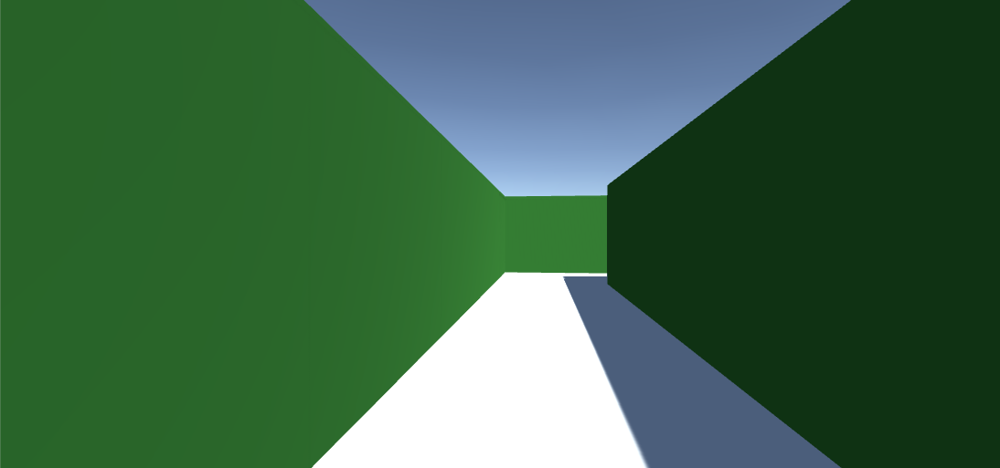

# Unity Maze Generator

A maze generator algorithm using the [recursive backtracker](https://weblog.jamisbuck.org/2010/12/27/maze-generation-recursive-backtracking) algorithm. After the maze generation, the real maze is created using block prefabs where you can move using a FPS control. A starting point and an end point are also randomly created as a goal.

	

This implementation is subject to many improvements and it's proposed as fast prototyped example rather than an efficient solution. Even the connections created have an attached NOTICE stating that there are unused connections because of the way the maze is generated. It could probably be greatly improved an any pull request or advice will be appreciated :)

## Requirements

* [Unity.](unity.com)

* The [Standard Assets](https://assetstore.unity.com/packages/essentials/asset-packs/standard-assets-for-unity-2017-3-32351) for the FPS controller.

## Contents

* Scripts/ 
    * **`MazeGenerator.cs`** Main script to generate the maze.
    * **`Cell.cs`** Class to implement each cell of the maze. (NOTICE: it's implemented for simplicity and readibility, it could be implemented with a more efficient data structure).
* Scenes/
    * **`Maze.unity`** A scene containing the maze generation algorithm and the FPS controller (player).
* My assets/
    * **`Materials/`** The materials for the prefabs.
    * **`Prefabs/`** The different prefabs for floor, walls, start and goal points.

## Usage

If you want to try, there are some built versions for different platforms in the Build/ folder.

To test the script, you need to copy the contents in the Assets/ folder: Scripts/, Prefabs/ and Materials/ into your project folder assigning the prefabs to the script public variables. The [Standard Assets](https://assetstore.unity.com/packages/essentials/asset-packs/standard-assets-for-unity-2017-3-32351) package should be imported in your Asset folder too and you must add a FPSController to a scene from the package and rename it to **Player**.

## Known issues

* The maze is implemented as a two dimensional array of cells and it could be implemented using one dimmensional int array as [javidx9](https://www.youtube.com/watch?v=Y37-gB83HKE). This may be a more efficient data structure.

* In the algorithm implementation only the S and E connections should be annotated as they are later used to generate the walls from the top left corner to the bottom right corner. The N and W connections are however computed.

* There might be two duplicated/collapsable for loops in the maze creation function.

